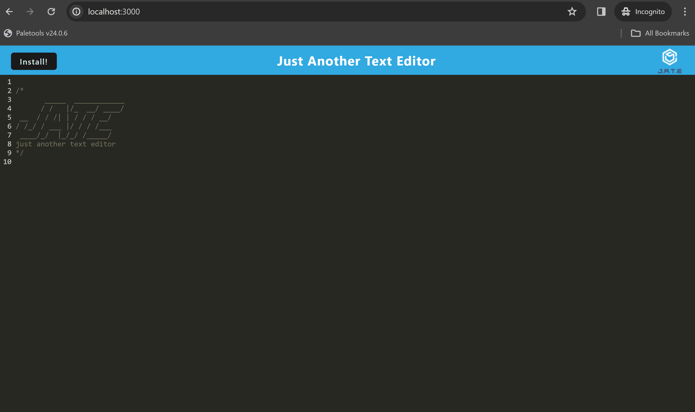

# Jate Text Editor

## Description

The Jate Text Editor is a progressive web application designed for text editing experience in the browser, when internet connection is available or not available

## Table of Contents

- [Installation](#installation)
- [Usage](#usage)
- [Credits](#credits)
- [Deployment](#deployment)
- [License](#license)
- [Screenshot](#screenshot)

## Installation
 Clone the repository to your local machine.
 Run `npm install` to install all dependencies.

## Usage
In the root directory, run `npm run build`.
In the root directory, run `npm run start`.
View the application in your browser at `localhost:3000`.

## Deployment
https://blessings-pwa-texteditor-r1.onrender.com/

## Credits
n/a

## License
MIT

## Screenshot

